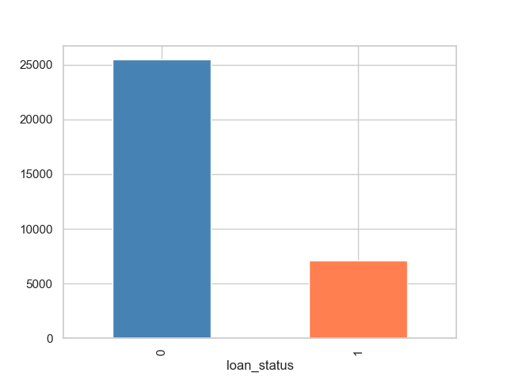

# Credit Risk Predictor

## Credit Risk Predictor — Final Report

**Author:** Raj Kumar Singh

This repository contains a machine-learning project that predicts whether a loan applicant is likely to **default** (fail to repay) or **stay current**. The summary below is written so readers without a background in machine learning or artificial intelligence can follow the goals, data, and results.

---

### Define the Problem Statement

Lenders lose money when borrowers default, and poor lending decisions can also hurt trustworthy applicants who are turned away without a clear, fair basis. The goal of this project is to **support better lending decisions** by estimating, from application and history information, how likely someone is to default.

**Goals:** Produce a repeatable way to flag higher-risk applications before approval, while keeping the process transparent enough to discuss with business and compliance stakeholders.

**Challenges:** Real-world lending data is messy (missing fields, unusual values, and unequal numbers of “paid off” vs. “default” cases). The model must be evaluated not only on “overall accuracy” but on whether it catches defaulters without generating unacceptable numbers of false alarms.

**Potential benefits:** Lower credit losses, more consistent decisions, and a foundation for human-in-the-loop review (for example, using scores to prioritize manual underwriting rather than replacing judgment entirely).

---

### Model Outcomes or Predictions

- **Type of learning:** **Supervised learning.** Each historical record includes a known outcome: whether the loan **defaulted** or not, which the algorithms learn from.
- **Problem type:** **Binary classification** — the output is one of two labels (default vs. non-default).
- **What you get from the model:** For a new applicant described by the same kinds of inputs, the system produces a **risk prediction** (typically a probability or a yes/no at a chosen thresold). That prediction can be used as a **risk score** for approval, pricing, or manual review.

**Unsupervised** methods (grouping people without using a default label) were not the focus of this capstone; the work centers on **supervised** classification.

---

### Data Acquisition

**Data used:** The project uses the **[Kaggle Credit Risk Dataset](https://www.kaggle.com/datasets/laotse/credit-risk-dataset/data)** — a single, public table of roughly **32,600 loan applications** with **12 columns**.

**Why this dataset:** It combines information that lenders often care about in one place: person-level details (e.g. age, income, employment length), loan terms (amount, interest rate, grade, purpose), and credit-history signals (e.g. prior default flag, credit history length). In a full production system, similar fields might be merged from **multiple internal and external sources** (loan origination system, credit bureau, collections). Here, one curated file stands in for that combined view so the modeling steps can be demonstrated clearly.

**Local setup:** Save the CSV as `data/credit_risk_dataset.csv` in the project root before running the notebooks.

**Visualization — does the data support the problem?** Exploratory plots help check whether defaults and non-defaults differ enough for prediction to be plausible. For example, the distribution of the target label shows class imbalance (more non-defaults than defaults), which matters for how we train and evaluate models.



Additional charts in the notebooks (correlations, relationships between features and default rate, ROC curves, model comparison figures) support the same story: several inputs are associated with default risk, so supervised models can learn useful patterns. Key comparison figures are also saved under `images/` (e.g. `model_comparison.png`, `roc_curves_comparison.png`).

---

### Data Preprocessing / Preparation

**Missing values**

- **`loan_int_rate`:** Many rows were missing an interest rate. Missing values were filled using the **median rate within each loan grade**, because rate and grade move together in practice.
- **`person_emp_length`:** Extreme values (e.g. impossibly long employment) were **capped** at a sensible upper bound (40 years) to reduce bad data effects.
- Rows that still lacked critical fields after these steps were **removed** so training uses complete cases for those variables.

**Inconsistencies and feature construction**

- New columns were added to make patterns easier to learn, in everyday terms:
  - **Income relative to loan size** (`income_to_loan_ratio`).
  - **High debt burden flag** (`debt_burden_high`) when the loan is a large share of income.
  - **Prior default on file** converted to a numeric yes/no (`cb_person_default_on_file_int`).
  - **Loan grade** encoded as an ordered numeric score (`loan_grade_ord`) where appropriate for the models.

**Encoding and scaling**

- Categorical information is prepared so algorithms can use it: for example, mapping “Y/N” default history to numbers and using ordinal encoding for loan grade where used in the numeric feature set.
- Models that assume similar scales on numbers (e.g. logistic regression) use **standardized** numeric inputs; tree-based models use the prepared features in forms suitable for those estimators, as implemented in the notebooks.

**Train / test split**

- The cleaned data were split into **training** (75%) and **test** (25%) sets with **stratified sampling**, so the proportion of defaults stays similar in both sets. This yields approximately **23,764 training** and **7,922 test** rows (exact counts match the notebook run).
- The test set is held out for **fair comparison** of models the project did not “see” during training.

---

### Modeling

Several **supervised classification** algorithms were trained and compared on the same prepared features and split:

| Approach | Role in the project |
|----------|---------------------|
| **Logistic regression** | Simple, interpretable baseline. |
| **Decision tree** | Easy to explain; prone to overfitting if unchecked. |
| **Random forest** | Many trees voting together; strong balance of performance and practicality. |
| **K-nearest neighbors (KNN)** | Compares a new applicant to similar past cases; **k** was tuned. |
| **Support vector machine (SVM)** | Included in the comparison; in this project’s setup it did not compete well with tree-based models. |
| **XGBoost** | Gradient-boosted trees; among the strongest scores on this data. |
| **Voting ensemble** | Combines multiple models’ probabilities for robustness. |

Hyperparameters were tuned where noted in the notebooks (e.g. KNN **k**, forest depth/tree settings, boosting parameters).

---

### Model Evaluation

**What was compared:** All of the above are **classification** models. They were scored on the same held-out test data.

**Metrics (plain language)**

- **Accuracy:** Share of all predictions that are correct — can be misleading when defaults are rare.
- **Precision:** When the model says “default,” how often it is right — important for avoiding unnecessary rejections.
- **Recall:** Of everyone who truly defaulted, how many the model catches — important for limiting losses.
- **F1 score:** A single balance between precision and recall.
- **ROC-AUC:** How well the model ranks risky vs. safe applicants overall (higher is better), without committing to one cutoff.

**What performed best (high level):** **XGBoost** achieved the highest ROC-AUC in this run; **Random Forest** and a **voting ensemble** were close behind. **Random Forest** was selected for deployment in this repository because it combines **strong performance** with **fast training**, **feature importance** for explanations, and **fewer external dependencies** than XGBoost.

Readers can reproduce tables, confusion matrices, and curves in `credit-risk-predictor.ipynb` or `credit-risk-predictor-technical-report.ipynb`.

---

## How to run the project

- **Python:** 3.x with packages from `requirements.txt`.
- **Data:** [Kaggle Credit Risk Dataset](https://www.kaggle.com/datasets/laotse/credit-risk-dataset/data) → `data/credit_risk_dataset.csv`.
- **Notebooks:** `credit-risk-predictor.ipynb`, `credit-risk-predictor-technical-report.ipynb` (technical report).

```bash
pip install -r requirements.txt
```

---

## Contact

For questions or collaboration, open an issue or reach out via the repository.
